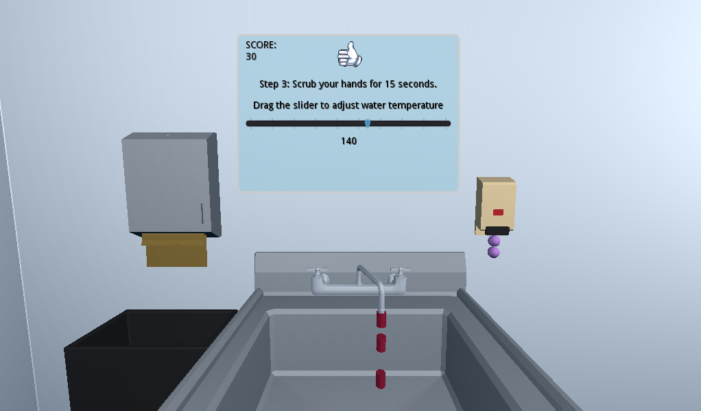
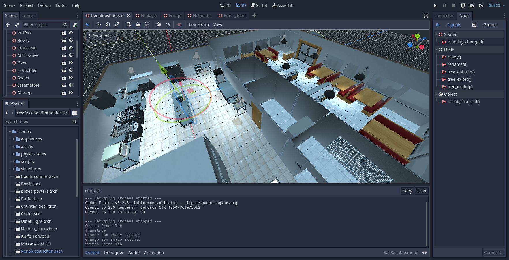
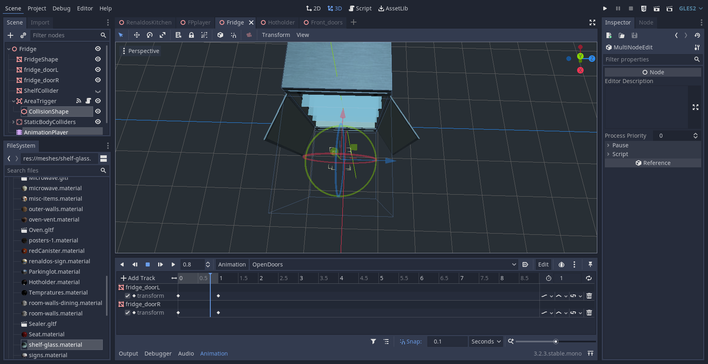

# Interactive Handwashing
Practice the steps of handwashing. 

### ToDo:
Create an introduction and start button?

Messages pop up if they play with the soap too much?

Add sounds for paper towel dispenser, soap dispenser, water, door knob, points. (wav or ogg)

Create a Theme for the UI, choose a bold font. 

Draw custom png sprites and png sequence of hands scrubbing (animated loop). 

The cursor starts as a graphic of a hand to touch the faucet. 

It switches to a pointing finger when it is over the temperature slider. 

It switches to 2 hands facing up while wetting and getting soap. 

Then changes to a png sequence of hands washing. Minimum of 6 frames? that loop. 
The viewer will need to click for 15 seconds to change the sequence image. maybe? 

Then switchs back to the starting hand to turn off the water. 

It changes to two hands with a paper towel until the dispenser is touched. 

Maybe the viewer has to decide between a cloth towel or the paper towel dispenser? 

Finally it changes to a single hand with a paper towel tilted down to open the door. 

While the camera moves back and rotates to look at the door. 

Demo: [http://dev.krissnik.com/games/handwash/](http://dev.krissnik.com/games/handwash/)

# Renaldos Kitchen

An interactive 3D space using the Godot game engine. 
Walk using W = forward S = back A = slide left D = right. 

Models were built in Blender with principled BSDF (PBR) shaders and exported to GLTF. 
Images are mostly 512 and 1024 px compressed jpg. 

The source blend files and images are in the folder kitchenModels/

The Godot project is in the folder kitchen/ 

scenes/ contains the prefabs to use in a project. It has several subfolders. 
RenaldosKitchen.tscn is the main scene. 

scenes/scripts contains the interative methods.

Demo: [http://dev.krissnik.com/games/kitchen/](http://dev.krissnik.com/games/kitchen/)

### ToDo: 
Export separate gltf files for interactive and physics items

Develop a static scene with an interactive appliance to play with.

### Interactive items
Import the gltf files into Godot, open it and save as .tscn, the native Godot scene format. 
Scene files (.tscn) with meshes that will be interactive should be separate gltf files to add scripts, particles, triggers and colliders.
Scenes are prefabs!

- Add a StaticBody.CollisionShape.box for presence. 
- Add a Area.CollisionShape.box for trigger. Add script to Area, connect the entered & exited signal nodes.
- Add an AnimationPlayer and animation to play when triggered. 

#### Appliances:
sink_Handwash trigger Water particle emitter

Microwave trigger opens door

Oven trigger opens Door and Rack

Fridge trigger opens door

Hotholder trigger opens door

#### Doors:
Front Door trigger

### Physics items
Fry_Pan

